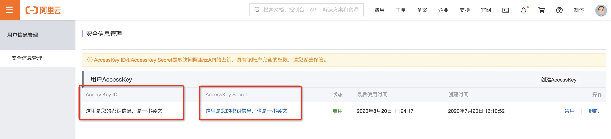
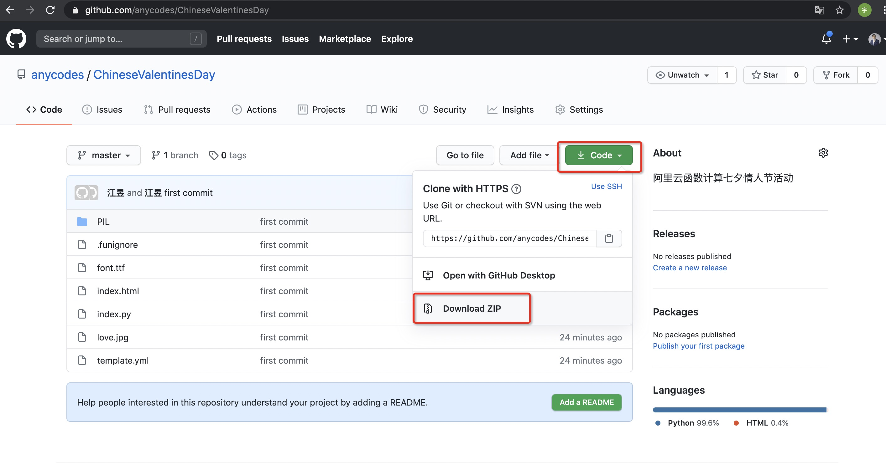
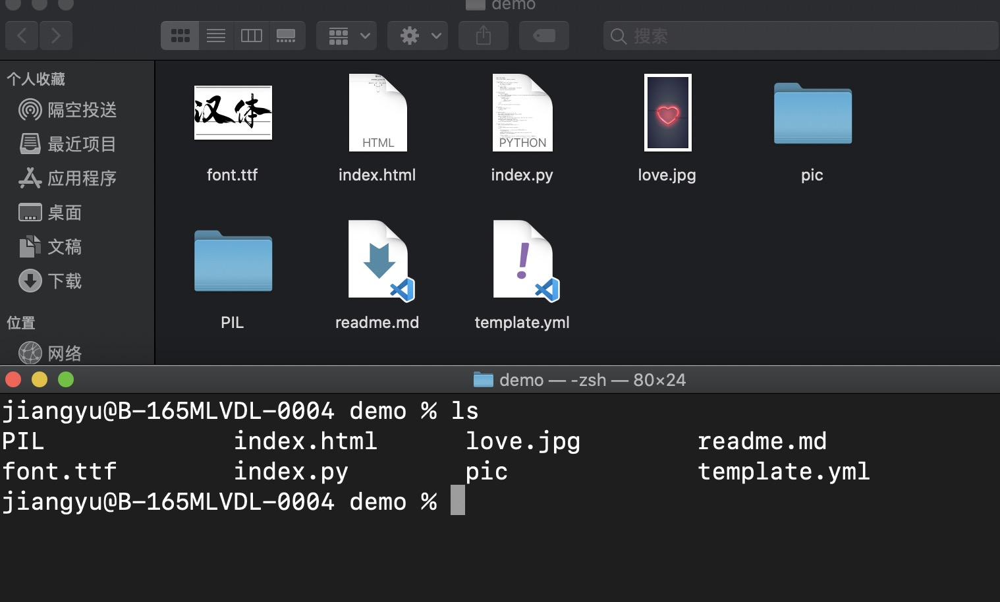
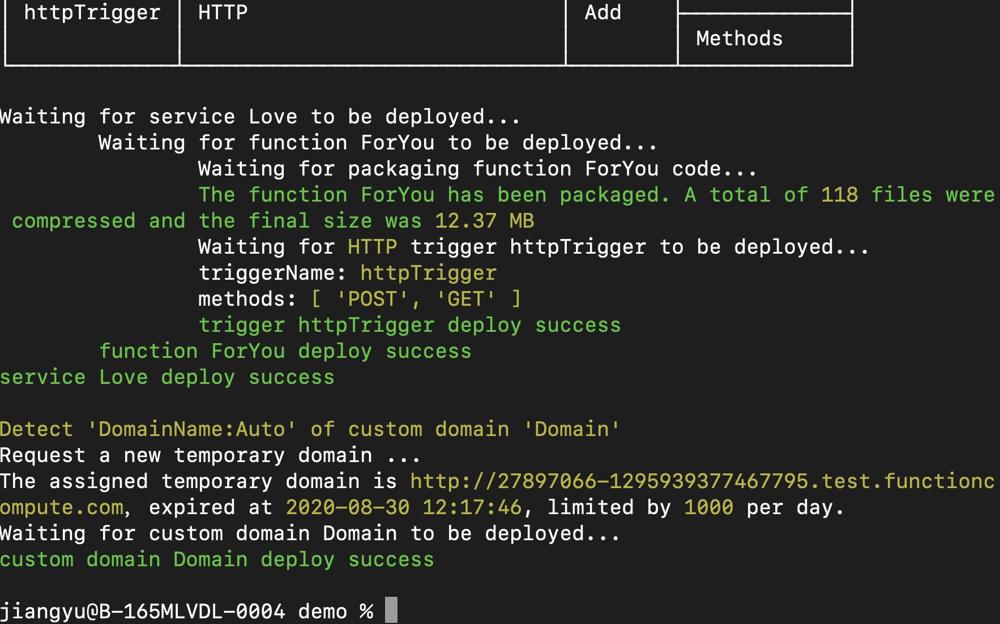
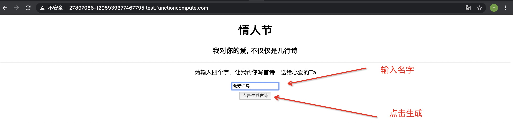
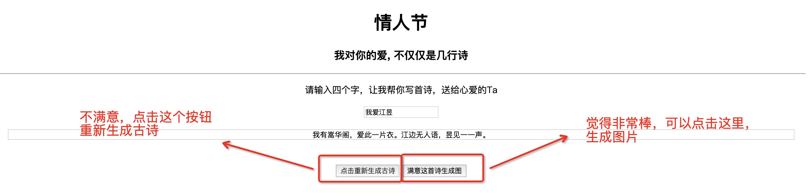

# 七夕活动文档

## 前言

随着函数计算发展的速度越来越快，函数计算在更多领域都有着更加有价值的应用。在音视频离处理领域，函数计算凭借着强大的离线处理能力以及按量付费能力，对离线音视频处理有着非常友好的"态度"，在实时处理的场景中，函数计算凭借着超高的性能，极致的弹性，也有着非常傲人的成绩；在人工智能领域，阿里云函数计算虽然表面上和大多数的函数计算产品一样，但是实际上，阿里云的函数计算具有更好的兼容性和包容性，因为其拥有NAS挂载能力，通过NAS挂载，之前很多由于"模型太大"导致代码包无法放到函数计算中的问题，就迎刃而解了；在Web场景下，阿里云的函数计算，更是因为其本身拥有HTTP函数，而让更多的Web应用，变得非常简单，轻松的可以直接放进来。

随着七夕节的到来，阿里云函数计算的小伙伴们在想：程序员的浪漫在哪里？

是的，程序员的浪漫在哪里？和函数计算有什么关系么？有的！函数计算凭借着超高的工程效率，以及具有按量付费的极低的成本，可以让所有的程序员，通过简单的几行指令，部署一个自己的表白神器，用技术为心爱的人写诗，将诗句，整理成图片，发送给心爱的Ta，这是程序员的浪漫，更是技术赋予我们的能力，也是阿里云函数计算的浪漫，祝有情人，终成眷属。

## 开通函数计算并准备相关凭证

这一部非常重要，各位小伙伴们，可以前往：https://fc.console.aliyun.com/ ，来开通函数计算，当大家看到如下图的时候，请注意复制保存您的主账号ID。


保存主账号ID之后，请点击`AccessKey`后面的查看按钮，查看您的个人密钥信息：



此时您需要保存您的`AccessKey ID`和`AccessKey Secret`。

> 重要提示: 云账号AccessKey是您访问阿里云API的密钥，具有该账户完全的权限，请您务必妥善保管！不要通过任何方式(eg, Github)将AccessKey公开到外部渠道，以避免被他人利用而造成 安全威胁 。强烈建议您遵循 阿里云安全最佳实践 ，使用RAM子用户AccessKey来进行API调用。

## 安装命令行工具：Fun

此时，您需要在本地安装有Node.js的相关开发环境。

然后您可以安装我们的开发者工具: `$ npm install @alicloud/fun -g`

> 如果在 Linux/MacOS 下执行报 "Error: EACCES: permission denied" 错误，请加上 sudo 执行：sudo npm install @alicloud/fun -g。

> 如果安装过程较慢，可以考虑使用淘宝 NPM 源：npm --registry=https://registry.npm.taobao.org install @alicloud/fun -g

安装完成之后。在控制终端输入 fun 命令可以查看版本信息：

```shell script
$ fun --version
3.6.1
```

> 具体安装方法，可以参考：https://github.com/alibaba/funcraft/blob/master/docs/usage/installation-zh.md

安装完成之后，我们可以配置一下我们的工具，在命令行输入`fun config`，之后，系统会先后弹出几个提醒：

- Aliyun Account ID： 就是我们第一次复制的那一长串数字
- Aliyun Access Key ID： 就是我们后来复制的那个很长的英文字符串`AccessKey ID`
- Aliyun Access Key Secret： 就是我们后来复制的那个很长的英文字符串`AccessKey Secret`
- Default region name： 可以选择杭州等地区

其余的选项默认按回车就好。

> 当然这一步骤也可以参考文档：https://help.aliyun.com/document_detail/146702.html

## 开发"爱"的网页

- 下载这个项目到本地：https://github.com/anycodes/ChineseValentinesDay ，可以点击下载按钮：

    
    
    也可以选择，通过`git clone`的方法： `git clone https://github.com/anycodes/ChineseValentinesDay.git`

- 完成上一步，我们在命令行进入到这个目录下:

    
    
    输入我们的部署指令：`fun deploy -y`: 
    
    
    
- 当我们看到这个窗口上给我们的这个地址，我们就可以非常简单，轻松愉快的在浏览器中打开它：

    > 为了给大家惊喜，不透露做好的真实效果，这里仅用一个小Demo展示，具体做好的效果，要聪明的你来发现哦！
  
  
  
  在输入框输入你的词汇：这里最好是四个字，例如你要是喜欢我，你就可以写'我爱江昱'，完成之后即可生成藏头诗：
  
  
  
  不满意的话，可以重新生成；满意的话，可以生成图片，发送给心爱的Ta：
  
  
  
## 思路拓展

这里面虽然说是生成了一个简单的图片，但是实际上，这个是一个人工智能+图像处理的项目。

其中关于人工智能部分：这里是通过对模型的训练，然后通过用户的输入，生成一段古诗词，这一部分的模型也跑在阿里云的函数计算上，但是由于模型太大可能需要NAS等，所以这里就没教大家如何部署这个模型，而是直接提供一个接口给大家使用。这样大家就可以通过最简单，最快速的方法体验到这个项目。

当然，大家在使用过程中，也可以自己对代码进行修改，对图片进行替换，这里只是一个抛砖引玉的过程。

古诗词仅仅是AI推理生成的，是否具有很高的文学价值等，这个我比较才疏学浅，不能判断，但是我相信，随着时代的发展，模型会越来越完善的。我也更相信，随着Serverless的不断发展，函数计算也会有更多，更有趣的小应用。这次是Serverless为你写诗，下次呢？期待每个小伙伴们的"脑洞"！


